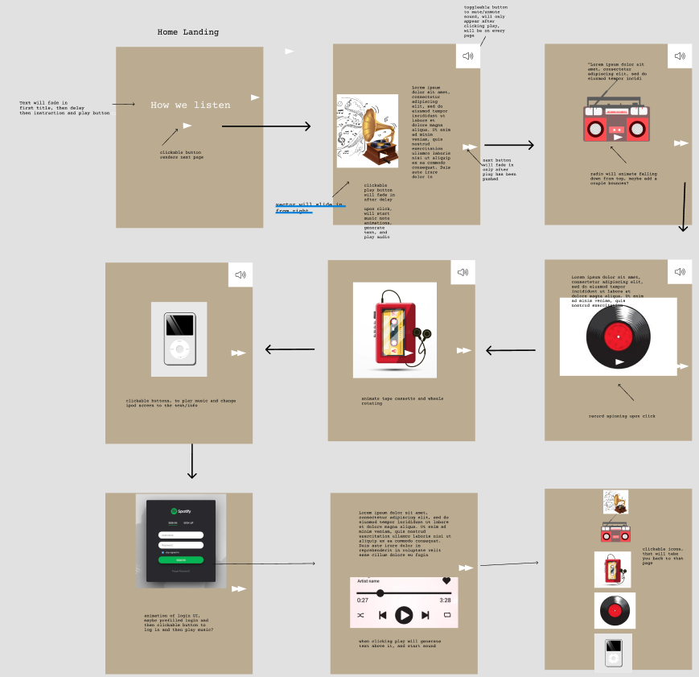
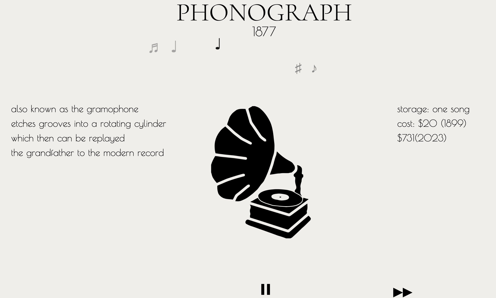
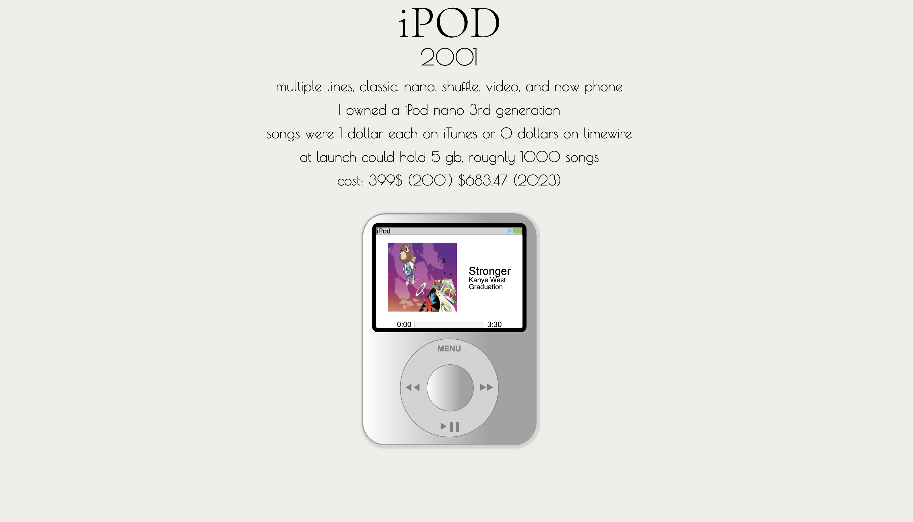
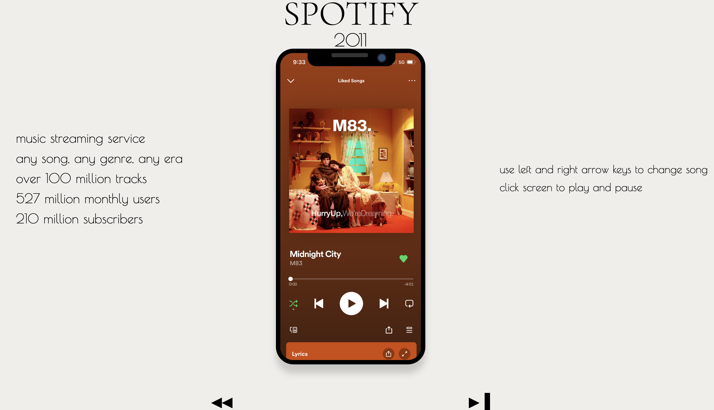

### HOW WE LISTEN

Here is the [Live Site Link](https://kennyvungo.github.io/JSProject/), check it out!

# BACKGROUND

This project is an interactive timeline of music listening devices. It will start at the phonograph and go through the major listening devices  created throughout time, such as the record player, radio, iPod etc. As you click through it will display facts about each device.

In How We Listen, users will be able to 
    click through the timeline to see the next music device
    click to return to the previous device
    interact with the vectors and start/stop the animations
    mute and unmute the music
    click on the icons at the end to return to that specific page

In addition, this project will include:
    A production README

# WIREFRAMES



# TECHNOLOGIES, LIBRARIES, API's
The project was implemented with the following technologies:
+ Webpack and Babel to bundle and transpile the source JavaScript codenpm to manage project dependencies
+ native HTML audio library


# Key Features

1. Interactive Music 
- Users can play pause and skip songs


2. Image Carousel


3. Interactive Devices
- Users can interact with each device


3a. Record Player Animation Code

``` CSS
.spin {
    animation: spin 1s infinite linear;
}

@keyframes spin {
    from {
        transform: rotate(0deg);
    }

    to {
        transform: rotate(360deg);
    }
}
```

### BONUS FEATURES
look into multiple color schemes/background for each device    
add a previous button for each device  
more custom animations  
